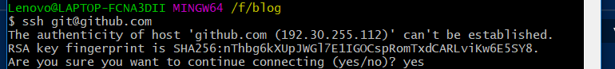

#### 1.输入命令$ git push origin master时，出现Everything up-to-date

我是在提交项目中新创建的文件时出现这个问题，是因为没有对新创建的文件执行
<!--more-->

```javascript
git add 新文件
git commit -m '提交描述信息'
```

这两个命令执行成功后再去执行

```javascript
git push origin master
```

现在应该就没有问题了

#### 2.Untracked files

```javascript
 git commit -m '内容提交'
On branch master
Your branch is up-to-date with 'origin/master'.
Untracked files:
        .gitignore
        .tmp/
        .watchmanconfig
        JsCode/
        Test/
        __tests__/
        android/
        app.json
        index.android.js
        index.ios.js
        ios/
        package.json
        setup.js
        yarn.lock
nothing added to commit but untracked files present
```

#### 3.Your local changes to the following files would be overwritten by merge

git stash
git pull
git stash pop

#### 4 error: Pulling is not possible because you have unmerged files

1.pull会使用git merge导致冲突，需要将冲突的文件resolve掉 git add -u, git commit之后才能成功pull.

2.如果想放弃本地的文件修改，可以使用git reset --hard FETCH_HEAD，FETCH_HEAD表示上一次成功git pull之后形成的commit点。然后git pull.
注意：

git merge会形成MERGE-HEAD(FETCH-HEAD) 。git push会形成HEAD这样的引用。HEAD代表本地最近成功push后形成的引用。

#### 5.git push时报错The requested URL returned error: 403
起因是在网上下载了后台代码，经过修改后想上传到github，git push时报错The requested URL returned error: 403，原因是这个代码中的.git文件夹是原代码的项目github仓库，这个网址我是提交不上的，那么，就要把原来的github地址改成自己的地址，修改 config 文件，找到 [remote "origin"] 节点下的 url 项，将这个url地址改为自己的github仓库地址，另一种方法是直接把项目中的.git文件夹删掉，再执行git init，然后进行提交。

#### 6.github Host key verification failed
主机密钥验证失败，其实这是缺少了 known_hosts 文件, 而且必须生成 github.com 的ip执行内容。
输入：ssh git@github.com
回车后出现下图的内容，输入yes，这时再提交，就没事了


#### 7. git pull报错：error: Your local changes to 'c/environ.c' would be overwritten by merge.  Aborting.
在使用git pull代码时，经常会碰到有冲突的情况，提示如下信息：
error: Your local changes to 'c/environ.c' would be overwritten by merge.  Aborting.
Please, commit your changes or stash them before you can merge.
这个意思是说更新下来的内容和本地修改的内容有冲突，先提交你的改变或者先将本地修改暂时存储起来。
处理的方式非常简单，主要是使用git stash命令进行处理，分成以下几个步骤进行处理。
##### 1、先将本地修改存储起来
```$ git stash```
这样本地的所有修改就都被暂时存储起来 。这时用git stash list可以看到保存的信息：
git stash暂存修改
其中stash@{0}就是刚才保存的标记。
##### 2、pull内容
暂存了本地修改之后，就可以pull了。
```$ git pull```
##### 3、还原暂存的内容
```$ git stash pop stash@{0}```
系统提示如下类似的信息：
````
Auto-merging c/environ.c
CONFLICT (content): Merge conflict in c/environ.c
````
意思就是系统自动合并修改的内容，但是其中有冲突，需要解决其中的冲突。
##### 4、解决文件中冲突的的部分
打开冲突的文件，会看到类似如下的内容：
git冲突内容
其中Updated upstream 和=====之间的内容就是pull下来的内容，====和stashed changes之间的内容就是本地修改的内容。碰到这种情况，git也不知道哪行内容是需要的，所以要自行确定需要的内容。
解决完成之后，就可以正常的提交了。